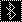
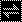

# On this fork

In the same way the original display "highlights changes only" when changing layers, I've inverted the highlighted bluetooth/peripheral board link icons. I've also made them full-width and shorter. Basically, I want to recognize if something's disconnected at a glance.

## Visual comparison

| Normal (22x22) | Full Width Inverted (68x18) |
| --- | --- |
|  |  |
|  |  |
|  |  |
|  |  |
|  |  |
|  |  |

## Modifying assets

To go image -> C array: [LVGL image converter](https://lvgl.io/tools/imageconverter)

To go C array -> image: [image2cpp](https://javl.github.io/image2cpp/)

To upload images and modify image pixels: [piskel](https://www.piskelapp.com/p/create/sprite/)

# Pinning original repo on ZMK v0.2

```yaml
# config/west.yml
manifest:
  remotes:
    - name: zmkfirmware
      url-base: https://github.com/zmkfirmware
    # ...
    - name: infely
      url-base: https://github.com/infely
  projects:
    - name: zmk
      remote: zmkfirmware
      revision: v0.2
      import: app/west.yml
    # ...
    - name: nice-view-battery
      remote: infely
      revision: a9ebccd
  self:
    path: config
```

# nice-view-battery


### All You Need: nice!view Battery

I've spent time developing practical customization for the nice!view displays, focusing on what truly matters. No unnecessary features, no input lag - just a clean layout provides everything when you need it at a quick glance. Enjoy!

Add this shield to your keymap repo (see usage below) and run the GitHub action to build your firmware.

## Customization

My preference is to comment out the `display-name` for your base layer so it highlights changes only, keeping layout clean and visualy appealing. But the final decision on you.


## Usage

To use this shield, first add it to your `config/west.yml` by adding a new entry to remotes and projects:

```yml
manifest:
  remotes:
    - name: zmkfirmware
      url-base: https://github.com/zmkfirmware
    - name: infely                             # new entry
      url-base: https://github.com/infely      # new entry
  projects:
    - name: zmk
      remote: zmkfirmware
      revision: main
      import: app/west.yml
    - name: nice-view-battery                  # new entry
      remote: infely                           # new entry
      revision: main                           # new entry
  self:
    path: config
```

Now, simply swap out the default nice_view shield on the board for nice_view_battery in your `build.yaml` file.

```yml
---
include:
  - board: nice_nano_v2
    shield: corne_left nice_view_adapter nice_view_battery  # updated entry
  - board: nice_nano_v2
    shield: corne_right nice_view_adapter nice_view_battery # updated entry
```

## Configuration

Modify the behavior of this shield by adjusting these options in your personal configuration files. For a more detailed explanation, refer to [Configuration in the ZMK documentation](https://zmk.dev/docs/config).

| Option                             | Type | Description                                      | Default |
| ---------------------------------- | ---- | ------------------------------------------------ | ------- |
| `CONFIG_NICE_VIEW_WIDGET_INVERTED` | bool | To enable color inversion, set the option to `y` | n       |
